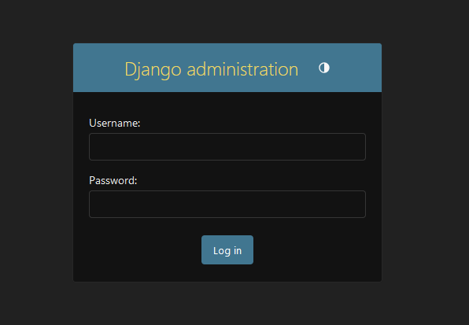
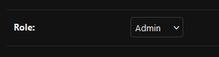

# Praca inzynierska: Projekt i implementacja platformy e-learningowej do nauki programowania


## O projekcie

Aplikacja pozwala na tworzenie kursuw programistycznych, gdzie użytownicy mogą uczyć się podstaw programowania oraz algorytmiki. Na podstawie przygotowanych przez prowadzączego wykładów, można rozwiązać zadania, które będą automatycznie sprawdzane przez system.

## Wymagania

- Python 3
- Redis (na Windowsie polecam użycie WSL2 aby go uruchomić)
- Docker, w tym obrazy:
```
REPOSITORY   TAG       IMAGE ID
gcc          9         4a7c9dbbd10a
mono         latest    16d98cfcc673
openjdk      17        5e28ba2b4cdb
```

## Instalacja i konfiguracja:

1. Upewnij się że wszystko z sekcji wymagania jest zainstalowane:
    - Windows:
        - Python 3: https://www.python.org/downloads/
        - Docker Desktop: https://www.docker.com/products/docker-desktop/
        - WSL: https://ubuntu.com/desktop/wsl
    - Linux:
        - Python 3:
        ```bash
        sudo apt install python3
        ```
        - Docker: https://docs.docker.com/engine/install/ubuntu/
        - Redis:
        ```bash
        sudo apt install redis-tools
        ```
2. Przygotuj wirtualne środowisko oraz uruchom je:
```bash
pip install virtualenv

### Linux:

virtualenv env
source env/bin/activate

### Windows:

python -m venv env
env\Scripts\activate
```
3. Zainstaluj potrzebne pakiety:
```bash
pip install -r /path/to/requirements.txt
```
4. Zainstaluj obrazy dockerowe:
```bash
docker pull gcc:9
docker pull mono:latest
docker pull openjdk:17

docker images ### Do weryfikacji
```
5. Przejdź do katalogu z plikiem manage.py. Na początek wykonaj migracje bazy:
```bash
python manage.py makemigrations
python manage.py migrate
```
6. Stwórz superusera:
```bash
python manage.py createsuperuser ### Przejdz przez kolejne kroki
```
7. Uruchom aplikacje. Do działania wszystkich funkcjonalności należy uruchomić wszystkie elementy oddzielnie (np. w innych terminalach):
    - Aplikacja (jeżeli system nie wymaga aktualnie weryfikacji zadań, można tylko to):
    ```bash
    python manage.py runserver ### Lokalnie
    python manage.py runserver 0.0.0.0:8000 ### Na sieci port 8000
    ```
    - Docker:
        - Linux:
        ```bash
        sudo systemctl start docker
        ```
        - Windows: Uruchom aplikacje Docker Desktop
    - Redis:
    ```bash
     redis-cli ### Upewnij się że w settings.py adres pokrywa się ze zmienną CELERY_BROKER_URL i razie potrzeby zmień
    ```
    - Celery(zmień liczbę concurency jeżeli chcesz inną liczbę procesów pracujących jednocześnie lub usuń jeżeli nie chcesz podać limitu):
    ```bash
    celery -A sprawdzarka_dyplomowa worker --loglevel=info -P eventlet --concurrency=6
    ```
8. Twój superuser jest zarejestowany już w bazie, ale będzie on miał role studenta. By nadać mu uprawnienia do tworzenia kursów, wykładów oraz zadań, przejdź do panelu admina i zmodyfikuj swoje konto zmieniając role na inną:
    - Przejdź na http://127.0.0.1:8000/admin/ (lub inny adres jeżeli pod innym jest postawiona aplikacja)
    - Zaloguj się kontem superusera:

        

    - Wybierz tabele Users na samym dole i znajdź tam swoje konto.
    - Pojawią się informacje zapisane w rekordzie twojekgo konta, przejdź na sam dół oraz zmień role na inną:

        

## Konfiguracja przed przejściem na produkcje:

1. Przejdź do pliku sprawdzarka_dyplomowa/settings.py.
2. Wygeneruj nowy klucz by nie używać tego z developmentu:
```python
SECRET_KEY = "Tu nowy SECRET_KEY'
```
3. Ustaw listę dozwolonych hostów, np.:
```python
ALLOWED_HOSTS = ['moj_host', 'localhost', '127.0.0.1']
```
4. Wyłącz tryb DEBUG:
```
DEBUG = False
```

## Szczegóły wprowadzania testów do zadań

- Pliki wejściowe dla testu muszą posiadać rozszerzenie .in
- Pliki wyjściowe dla testu muszą posiadać rozszerzenie .out
- Takie pliki można stworzyć za pomocą dowolnego narzędzia lub IDE (Notatnik, Visual Studio Code, Vim, Nano, itp.) 
- Ze względu na to, że kontenery Dockera działają tak, jakby były systemem linuxowym, należy zwrócić uwagę, czy jakieś dodatkowe niewidoczne dane pojawiły się w pliku (np NULL na początku, mimo, że go nie widać). Zdarza się to często przy tworzeniu testów na Windowsie.

